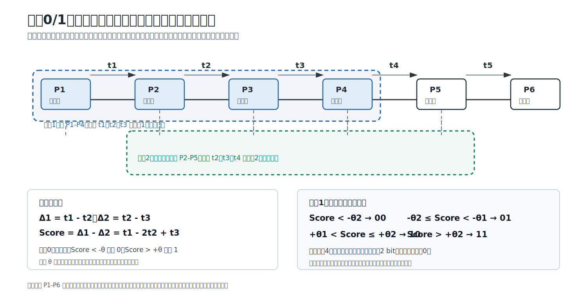
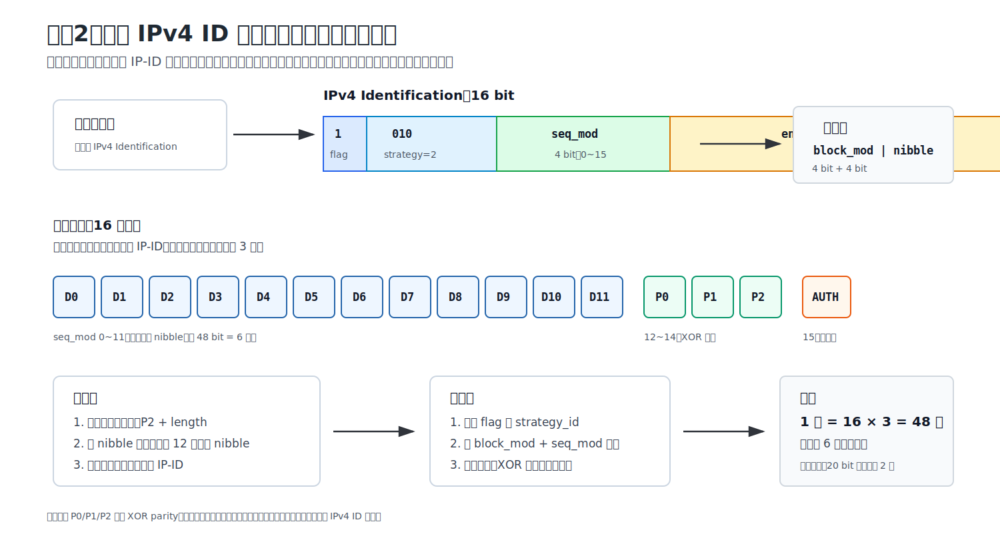
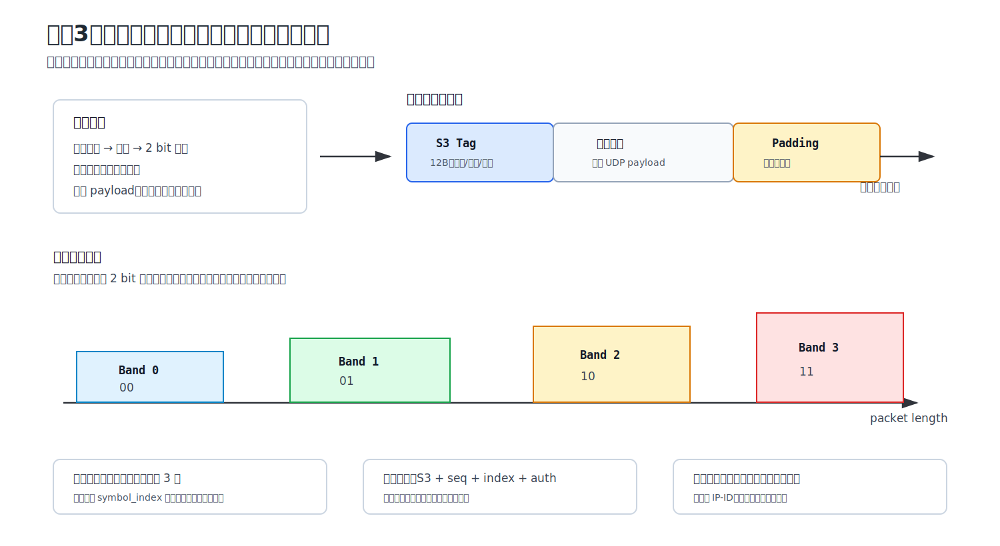
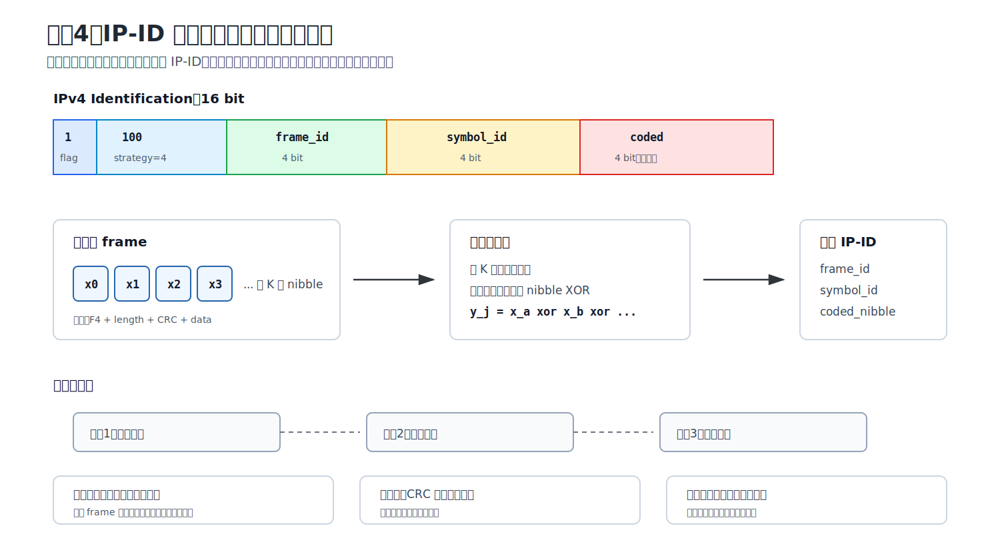
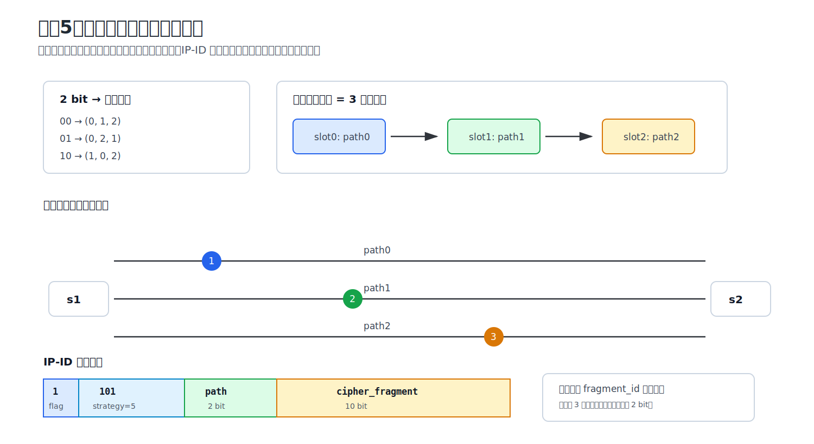

# 面向低空网络的多路径隐蔽传输机制设计与实现

> 本材料用于毕业设计中期审核答辩 PPT 制作。内容按 PPT 章节组织，可直接拆分为若干页幻灯片。

## 1. 课题背景

### 1.1 低空网络通信场景

随着无人机、低空巡检、应急通信、低空物流等应用发展，低空网络逐渐成为空天地一体化网络的重要组成部分。低空网络通常具有以下特点：

- 节点移动性强，链路状态变化快；
- 空地链路容易受到遮挡、干扰、天气和环境影响；
- 单一路径可靠性不足，需要多链路协同传输；
- 业务流对实时性、稳定性和安全性都有要求；
- 网络状态难以提前准确预测，需要实时感知和动态决策。

在这类场景下，如果希望在正常业务通信不中断的前提下，实现少量隐蔽信息传输，就需要同时考虑链路质量、隐蔽性、可靠性和传输顺序恢复。

### 1.2 隐蔽传输研究意义

隐蔽传输的目标不是简单加密通信，而是在正常业务流中嵌入额外信息，使外部观察者难以直接发现隐蔽通信行为。本课题关注的是：

- 在正常业务流存在的情况下，利用业务包的时序、包头字段、包长、路径选择等特征承载隐蔽数据；
- 通过多路径网络增强隐蔽传输的灵活性和可靠性；
- 结合实时链路状态，为不同链路选择合适的隐蔽传输策略；
- 在接收端解决多策略、多路径带来的乱序和解码重组问题。

因此，本课题不仅是单一隐蔽信道设计，而是面向低空多路径网络的隐蔽传输系统设计。

## 2. 研究目标

### 2.1 总体目标

设计并实现一个基于 P4 可编程交换机和 Python 端系统的多路径隐蔽传输原型系统。系统需要在业务流不中断的情况下，通过 INT 实时获取三条链路状态，并根据链路状态选择合适的隐蔽传输策略，使接收端能够尽可能正确地恢复发送端输入的隐蔽数据。

### 2.2 中期阶段目标

中期审核阶段重点不要求 PPO 强化学习完全训练完成，而是先打通基础闭环：

1. 搭建 `h1 -- s1 -- 三条链路 -- s2 -- h2` 的 P4/Mininet/BMv2 多路径拓扑。
2. 实现 h2->h1 方向的 INT 链路状态探测，能够得到三条链路的时延、丢包、带宽负载等状态。
3. 保证正常业务流不中断，使用 UDP iperf 模拟业务流。
4. 初步实现多个隐蔽传输策略，并完成策略库框架。
5. 实现接收端统一分发器，能够识别不同策略并按顺序重组隐蔽数据。
6. 实现规则选择器，根据 INT 状态输出策略计划，作为后续 PPO 的替代基线。
7. 实现五窗口用户演示系统，便于中期答辩现场展示。

## 3. 总体设计方案

### 3.1 网络拓扑

当前实验拓扑如下：

```text
h1 -- s1 == path0 / path1 / path2 == s2 -- h2
```

节点含义：

| 组件 | 角色 | 说明 |
|---|---|---|
| h1 | 地面端/发送端 | 输入隐蔽数据，接收 INT 状态报告，执行策略选择和发送 |
| s1 | 地面端 P4 交换机 | 负责路径调度、普通转发、接收 h2->h1 的 INT 报告 |
| s2 | 低空设备端 P4 交换机 | 负责反向 INT 探测触发，和 h2 同侧 |
| h2 | 低空设备端/接收端 | 接收正常业务流，解码隐蔽数据 |
| path0/path1/path2 | 三条并行链路 | 默认时延分别为 5ms、15ms、30ms，可动态设置丢包和时延 |

当前假设 h2 和 s2 位于低空网络设备侧，h1 和 s1 位于地面端。

### 3.2 系统总体闭环

系统闭环可以概括为：

```text
h2 -> h1: UDP iperf 业务流持续运行
       |
       v
s2 在真实业务包上 inline 插入 INT -> 三条路径状态 -> s1 剥离 INT 并报告给 h1
       |
       v
h1 根据 INT 状态生成策略计划
       |
       v
h1 输入隐蔽数据 -> 分块 -> 按策略/路径发送
       |
       v
h2 抓包 -> 识别策略 -> 解码 chunk -> 按 chunk_id 重组
```

其中 P4 交换机主要负责：

- 普通业务转发；
- 三路径调度；
- 真实业务包 inline INT 插入、剥离恢复和本地报告；
- 为策略4等多路径策略提供加权轮询路径调度。

Python 端主要负责：

- 隐蔽数据编码；
- 策略选择；
- 抓包和解码；
- 全局 chunk 重组；
- 用户演示窗口。

## 4. P4 数据平面设计

### 4.1 单 P4 文件复用

当前两个交换机运行同一个 P4 文件：

```text
p4/covert_int_switch.p4
```

不同交换机的角色差异通过流表和寄存器配置实现：

```text
p4/s1_commands.txt
p4/s2_commands.txt
```

这样设计的优点是：

- P4 程序通用，便于部署和维护；
- s1/s2 角色由控制平面配置区分；
- 后续扩展到更多交换机时，不需要为每个交换机维护不同 P4 文件。

### 4.2 路径调度模式

P4 数据平面当前支持多种路径模式：

| 模式 | 含义 | 典型用途 |
|---|---|---|
| 默认 LPM 转发 | 按普通 IPv4 表项转发 | 基础连通性 |
| 固定路径 | 所有跨交换机流量走指定 path | 单路径策略测试 |
| 轮询路径 | 每隔一定包数切换路径 | 多路径业务流、INT 覆盖三条链路 |
| 冗余复制 | 同一包复制到多条路径 | 冗余传输实验 |
| 加权轮询 | 按权重在多路径分发 | 策略4喷泉码多路径协同 |

路径控制通过 simple_switch_CLI 写寄存器完成，例如：

```text
register_write reg_path_mode 0 2
register_write reg_rr_burst_size 0 12
```

## 5. INT 链路状态探测设计

### 5.1 INT 方向选择

当前中期阶段采用 h2->h1 方向的反向 INT：

```text
h2 -> s2 -> 三条链路 -> s1 -> h1
```

原因是 h1 是隐蔽数据发送端，需要直接获得三条链路状态，然后选择后续 h1->h2 隐蔽传输策略。

### 5.2 INT 实现方式

为了既贴近真实业务流又保证终端业务不中断，当前 INT 采用：

```text
真实业务包 inline INT + 终点交换机剥离恢复 + 本地 UDP 报告
```

流程为：

1. h2 持续向 h1 发送 UDP iperf 业务流。
2. s2 根据采样间隔从业务流中触发 INT。
3. s2 在采样命中的真实业务包中插入 4 字节 compact INT shim 和第一跳 probe_data。
4. 该业务包携带 INT 只经过 s2-s1 交换机间链路。
5. s1 补齐第二跳 probe_data 后本地复制两份：一份剥离 INT 并恢复原业务包交给 h1，另一份转成 UDP/50100 报告给 h1。
6. h1 的 Python 程序解析报告，更新三条链路状态。

这种方式的优点是：

- h1/h2 看到的仍是恢复后的原业务包；
- 不影响 h1/h2 业务流；
- INT 只在交换机间链路临时存在，终端侧不需要处理 INT 头；
- INT 报告可由终端 Python 程序直接处理。

### 5.3 INT 指标

当前 h1 可以解析以下链路状态：

| 指标 | 含义 |
|---|---|
| delay_ms | 源交换机出口到宿交换机入口的估计链路时延 |
| jitter_ms | 时延抖动 |
| loss_rate | 基于源交换机出端口与下一跳入端口累计包数差计算的业务链路丢包率 |
| bw_utilization | 相对带宽负载 |
| qdepth_avg | 出端口队列深度均值 |
| sample_count | 当前统计窗口内样本数 |

## 6. 隐蔽传输策略库设计

本项目将隐蔽传输策略设计成可注册、可切换、可统一解码的策略库。策略编号由接收端统一识别，发送端根据链路状态和控制平面决策选择策略与路径。当前中期阶段的闭环验证以真实 UDP `iperf` 业务流为载体：发送端用户态代理复用业务包，在包间时序、IPv4 ID、业务包长度或多路径调度行为中嵌入隐蔽信息；接收端代理解析隐蔽信息后继续交付业务数据，因此业务应用本身不需要理解隐蔽字段。

### 6.1 策略库总览

| 策略 ID | 策略名称 | 信道类型 | 隐蔽载体 | 当前定位 |
|---:|---|---|---|---|
| 0 | 二阶差分相对时序 | 时序型 | 连续业务包到达间隔 | 高隐蔽、低速率基线策略 |
| 1 | 二阶差分四级时序 | 时序型 | 连续业务包到达间隔 | 策略0的容量增强版 |
| 2 | 可靠 IP-ID 存储信道 | 存储型 | IPv4 Identification 字段 | 单路径抗丢包兜底策略 |
| 3 | 统计包长分布信道 | 统计特征型 | UDP 业务包长度区间 | 默认快速传输策略 |
| 4 | IP-ID 喷泉码多路径协同 | 存储型 + 多路径协同 | IPv4 ID 与多路径冗余符号 | 多路径抗丢包策略，必须至少两条路径 |
| 5 | 多路径路径序列信道 | 行为型/时序型 | 多个连续包的路径排列 | 利用路径调度行为承载信息的扩展策略 |

策略相关代码主要位于 `python/covert_strategies/`：公共接口在 `base.py`，策略注册表在 `strategy_registry.py`，全局会话切块与重组在 `session.py`。五窗口演示中由 `experiments/user_demo/topology_service.py` 调用规则选择器与策略编码器，由 `experiments/udp_covert_proxy.py` 承载真实 UDP 业务代理测试。

### 6.2 策略0：二阶差分相对时序信道

代码路径：

```text
python/covert_strategies/timing_high_covert.py
python/covert_strategies/timing_sync_tag.py
experiments/user_demo/topology_service.py::timing_config_for_state()
```

策略0属于时序型隐蔽信道，不把真实隐蔽比特直接写入 IP-ID 或端口号等显式协议字段，而是通过连续业务包的发送/到达间隔关系承载信息。当前实现使用 4 个连续带同步标签的业务包形成一个滑动窗口。设 4 个包的到达时间为 `T0,T1,T2,T3`，三个相邻间隔为：

```text
d1 = T1 - T0
d2 = T2 - T1
d3 = T3 - T2
```

策略0计算二阶差分判决量：

```text
S = (d1 - d2) - (d2 - d3) = d1 - 2*d2 + d3
```

判决规则为：

```text
S < -T  -> 隐蔽比特 0
S > +T  -> 隐蔽比特 1
-T <= S <= +T -> 当前窗口不可靠，标记为 unknown
```

与早期“短间隔/长间隔”方案相比，二阶差分关注的是间隔变化的相对曲率，而不是某一个绝对时延值，因此对慢变背景时延更稳。为了提高效率，窗口在块内滑动复用业务包：第 `i` 个比特使用 `Pi, Pi+1, Pi+2, Pi+3`，下一个比特复用后三个包并加入新包。实现中每个块包含若干个隐蔽符号，只需要额外补 3 个边界包，因此不会每传 1 bit 都重新发送 4 个完全独立的包。

同步方式采用方案B：payload 前部有 2 字节轻量同步标签，用于记录 `frame_id`、`strategy_id`、`phase`、`symbol_index` 等对齐信息。同步标签不承载真实隐蔽比特，只帮助接收端在丢包后定位当前窗口，避免丢一个包导致后续全部错位。标签经过轻量异或混淆，降低明文字段特征。

策略0的时间阈值不是固定常数。`topology_service.py::timing_config_for_state()` 会根据 INT 得到的链路 `delay_ms` 和 `jitter_ms` 动态生成参数：

```text
T = clamp(max(2.0, jitter_ms * 3.0, delay_ms * 0.015), 2.0, 35.0)
base_gap = clamp(max(6.0, jitter_ms * 4.0, delay_ms * 0.04), 6.0, 80.0)
second_diff_delta = clamp(max(T * 2.4, jitter_ms * 6.0, delay_ms * 0.04, 6.0), 6.0, 90.0)
```

也就是说，链路抖动小时缩短间隔以提高速率；链路抖动或时延变大时扩大二阶差分幅度，提升判决稳定性。策略0适合低丢包、低抖动、强调隐蔽性的链路，不适合作为高吞吐主力。



### 6.3 策略1：二阶差分四级时序信道

代码路径：

```text
python/covert_strategies/timing_high_capacity.py
python/covert_strategies/timing_sync_tag.py
experiments/user_demo/topology_service.py::timing_config_for_state()
```

策略1是策略0的容量增强版本，同样使用 4 个连续业务包形成滑动窗口，也同样计算二阶差分判决量：

```text
S = (d1 - d2) - (d2 - d3)
```

区别在于策略1不只把判决量分成正负两类，而是划分为四个可靠区间，每个窗口承载 2 bit：

```text
S < -T2              -> 00
-T2 <= S < -T1       -> 01
+T1 < S <= +T2       -> 10
S > +T2              -> 11
其他区域             -> unknown
```

其中 `[-T1,+T1]` 是保护间隔，用于避免抖动导致误判；`T2` 用于区分强负/弱负、弱正/强正。发送端根据待传输的 2 bit 符号选择目标二阶差分幅度，接收端按同样阈值分类。策略1仍然使用 `timing_sync_tag.py` 中的 2 字节同步标签记录窗口编号、phase 和符号序号，保证接收端能够把业务包重新聚合为正确窗口。

自适应参数由 INT 状态驱动：

```text
T1 = clamp(max(2.0, jitter_ms * 2.5, delay_ms * 0.012), 2.0, 25.0)
T2 = clamp(max(T1 * 2.8, jitter_ms * 5.0, delay_ms * 0.03), T1 * 2.2, 70.0)
score_step = clamp(max(T1 * 1.8, jitter_ms * 4.0, delay_ms * 0.025, 5.0), T1 * 1.2, T2)
base_gap = clamp(max(6.0, jitter_ms * 3.5, delay_ms * 0.035), 6.0, 70.0)
```

因此在低抖动链路上，策略1可以用较小间隔快速发送；在抖动增加时，它会自动拉大阈值和间隔。策略1的优点是容量高于策略0，缺点是对抖动更敏感，适合稳定链路上的时序容量增强，不适合拥塞或强抖动链路。

### 6.4 策略2：可靠 IP-ID 存储信道

代码路径：

```text
python/covert_strategies/protocol_high_reliability.py
python/covert_strategies/ip_id_codec.py
```

策略2属于协议字段存储型隐蔽信道，核心目标是抗丢包和抗乱序。它利用 IPv4 Identification 字段的 16 bit 写入自描述信息和加密后的半字节数据。当前实现的 IP-ID 布局为：

```text
bit15       covert_flag = 1
bits14-12   strategy_id = 2
bits11-8    seq_mod，块内片段序号 0~15
bits7-0     encrypted_value
```

`encrypted_value` 解密后继续拆分为：

```text
高4 bit：block_mod，块号模16，用于乱序后的重新分组
低4 bit：data_nibble，真实数据半字节、冗余半字节或认证半字节
```

发送端先给隐蔽数据加帧头：

```text
P2 || length(4B) || payload
```

随后把帧数据拆成半字节，并按块组织。每个块包含：

```text
12 个数据半字节 + 3 个 XOR 冗余半字节 + 1 个认证半字节
```

其中 3 个 XOR 冗余半字节分别对应 3 组数据，每组 4 个数据半字节生成 1 个校验半字节。这样在组内缺失一个半字节时，可以通过 XOR 恢复。每个片段默认重复发送 3 次，接收端对同一 `block_mod + seq_mod` 的候选值做多数投票，再结合认证半字节判断该块是否可信。

策略2的接收流程为：先根据 `covert_flag + strategy_id` 初筛候选包，再解密 `encrypted_value` 得到 `block_mod + data_nibble`，随后按块号和片段序号重排。若某个数据半字节缺失但对应 XOR 组满足恢复条件，则恢复该半字节；若认证不通过，则丢弃该块，避免输出错误数据。最后根据 `P2` 帧头和长度字段还原原始隐蔽数据。

策略2的优势是乱序不敏感、轻中度丢包下仍可恢复，适合作为差链路兜底策略。代价是每个业务包只承载较少真实信息，并且使用 IP-ID 字段，隐蔽性弱于纯时序策略和路径序列策略。



### 6.5 策略3：统计包长分布信道

代码路径：

```text
python/covert_strategies/statistical_fusion.py
experiments/udp_covert_proxy.py
```

策略3属于统计特征型隐蔽信道，不直接在 IP-ID 中写真实数据，而是利用业务包长度所在的合法区间承载符号。默认配置中使用 4 个长度区间，因此每个业务包长度符号可承载 2 bit：

```text
(96,160)、(320,520)、(720,940)、(1100,1360) -> 4 类符号 -> 2 bit
```

发送端首先对白化后的隐蔽数据按 2 bit 切成符号，再根据密钥对“符号到长度区间”的映射做伪随机排列，避免长期出现固定“长度区间 = 固定比特”的明显统计特征。随后在对应长度区间内伪随机选择一个目标包长，而不是固定使用某个长度值。

每个策略3业务包 payload 前部包含 12 字节同步小头：

```text
magic='S3' || version || seq_num || symbol_index || total_symbols || total_bits || repeat_index || auth
```

该小头经过异或掩码加扰，用于接收端识别策略3帧、定位符号序号和执行重复投票。真实隐蔽符号由包长区间承载，同步小头只负责边界、顺序和认证。默认情况下每个符号重复发送多轮，接收端根据包长分类结果进行加权投票，选择得分最高的符号作为恢复结果。

策略3适合低丢包、低抖动、业务流允许一定 payload 长度变化的链路。它的速率明显高于策略0/1，因此是当前五窗口演示中的默认快速策略。高丢包或强干扰场景下，规则选择器会倾向切换到策略2或策略4兜底。



### 6.6 策略4：IP-ID 喷泉码多路径协同信道

代码路径：

```text
python/covert_strategies/full_path_redundancy.py
p4/covert_int_switch.p4
experiments/udp_covert_proxy.py
```

策略4是多路径协同策略，不能作为单路径策略单独使用。它把隐蔽数据编码成喷泉码符号，再把符号分散到两条或三条路径上传输，从而把单条链路丢包风险分散到多路径系统中。

策略4的 IP-ID 字段布局为：

```text
bit15       valid flag = 1
bits14-12   strategy_id = 4
bits11-8    frame_id
bits7-4     symbol_id
bits3-0     encrypted coded_nibble
```

发送端先给隐蔽数据加帧头：

```text
F4 || length(2B) || CRC32(4B) || payload
```

然后把帧数据拆成 4 bit 源符号。默认每个 frame 包含 `k=12` 个源半字节，最多生成 16 个 coded symbol。前 `k` 个 symbol 类似系统符号，后续 symbol 由多个源符号 XOR 组合得到。接收端不要求收到全部 symbol，只要收集到足够多线性独立符号，就可以使用 GF(2) 高斯消元恢复源半字节，再通过 CRC 校验确认数据正确。

策略4的多路径协同体现在发送调度上：发送端为每个 coded symbol 生成业务包，P4 根据加权轮询或路径控制把这些 symbol 分散到多条链路。对于接收端来说，不需要知道每个 symbol 具体从哪条路径来，只需要按 `frame_id + symbol_id` 收集符号即可。当某条路径发生丢包时，只要其他路径补充了足够多独立符号，仍然能够恢复数据。

策略4适合多条链路都存在一定丢包、但没有完全不可用的场景，是本课题最能体现“多路径协同隐蔽传输”的策略。它的限制是必须至少两条路径参与，且单个 IP-ID 只携带 4 bit coded_nibble，长数据需要上层 session/chunk 继续切分。



### 6.7 策略5：多路径路径序列信道

代码路径：

```text
python/covert_strategies/path_sequence.py
p4/covert_int_switch.p4 中 PATH_MODE_IPID_HINT
```

策略5把“路径选择行为本身”作为隐蔽载体。它不把真实隐蔽比特直接写入 IP-ID，而是通过连续 3 个业务包经过的路径排列表示 2 bit 符号。例如：

```text
path0 -> path1 -> path2 表示 00
path0 -> path2 -> path1 表示 01
path1 -> path0 -> path2 表示 10
path1 -> path2 -> path0 表示 11
```

发送端先给隐蔽数据加帧头：

```text
P5 || length(2B) || CRC32(4B) || payload
```

随后把帧数据拆成 2 bit 符号，每个符号映射为一个三包路径序列。也就是说，一个策略5符号需要 3 个业务包共同表达，接收端按 3 个包组成一个窗口，根据窗口内真实路径顺序恢复 2 bit。

为了让接收端识别策略5承载包并解决窗口排序问题，策略5仍在 IP-ID 中写入轻量自描述信息，但它不直接写真实隐蔽比特：

```text
bit15       valid flag = 1
bits14-12   strategy_id = 5
bits11-10   path_id
bits9-0     encrypted fragment_id
```

其中 `path_id` 用于辅助接收端确认路径，`fragment_id` 用于确定窗口编号和窗口内位置，经过密钥扰动后写入，降低明显递增特征。P4 在 `PATH_MODE_IPID_HINT` 模式下可以读取路径提示，把业务包发往指定链路。

策略5的优点是隐蔽信息主要体现在多路径调度行为中，单个包头字段不直接暴露真实数据；缺点是对路径控制精度和窗口完整性要求高，丢一个包就可能破坏当前三包窗口。因此它更适合作为多路径隐蔽信道创新点展示，而不是高丢包环境下的默认主力策略。



### 6.8 统一识别、分块与乱序重组

六个策略能够协同工作的关键是统一的 session/chunk 机制和接收端分发器。发送端输入一段隐蔽比特流后，系统不会要求整段数据只能用一个策略，而是先在全局层切分为若干 chunk/segment。每个 chunk 带有 `session_id`、`chunk_id`、长度和 CRC 等元信息，随后根据当前链路状态分配给某个策略和某条或多条路径。

接收端先做策略识别，再交给对应策略内部解码器：

| 策略 | 接收端识别依据 | 内部顺序恢复依据 |
|---|---|---|
| 策略0 | payload 同步标签 + 到达时间 | `symbol_index` 与 4 包滑动窗口 |
| 策略1 | payload 同步标签 + 到达时间 | `symbol_index` 与四级二阶差分窗口 |
| 策略2 | IP-ID 中 `covert_flag + strategy_id=2` | `block_mod + seq_mod`、重复投票、XOR 冗余 |
| 策略3 | 12B 加扰同步小头 `S3` | `symbol_index + total_symbols + repeat_index` |
| 策略4 | IP-ID 中 `strategy_id=4` | `frame_id + symbol_id`、喷泉码解码 |
| 策略5 | IP-ID 中 `strategy_id=5` | `fragment_id` 推导窗口编号与槽位 |

策略内部恢复出 chunk 后，再由全局 session 层按 `chunk_id` 排序并做 CRC 校验，最终拼回原始隐蔽数据。这样即使不同 chunk 使用不同策略、经过不同路径、到达顺序不同，接收端也可以统一恢复。动态切换时系统按 chunk/segment 边界切换，而不是在策略0/1的时序窗口或策略4的喷泉码 frame 中途强切，避免破坏解码边界。

### 6.9 策略适用场景对比

| 策略 | 容量 | 隐蔽性 | 抗丢包 | 是否多路径 | 建议使用场景 |
|---|---|---|---|---|---|
| 策略0 | 低 | 高 | 低到中 | 单路径 | 低抖动链路，高隐蔽性展示 |
| 策略1 | 中低 | 较高 | 低到中 | 单路径 | 稳定链路，时序容量增强 |
| 策略2 | 中低 | 中 | 高 | 单路径 | 丢包/抖动较高时可靠兜底 |
| 策略3 | 中高 | 中高 | 中 | 单路径 | 链路较干净时的默认快速策略 |
| 策略4 | 中 | 中 | 高 | 必须多路径 | 多链路均有丢包时的协同恢复 |
| 策略5 | 低到中 | 高 | 低到中 | 必须多路径 | 展示路径调度行为隐蔽信道 |

## 7. 乱序与多策略重组设计

### 7.1 问题来源

多路径隐蔽传输面临的核心难点之一是乱序：

- 不同路径时延不同；
- 不同策略每个符号需要的包数不同；
- 策略切换会导致同一隐蔽数据被分散到不同路径和不同策略；
- 丢包可能导致后续解码错位。

### 7.2 两层顺序恢复机制

当前系统采用两层机制解决乱序问题：

第一层：策略内部重排。

| 策略 | 内部顺序依据 |
|---|---|
| 策略0/1 | 同步标签和到达时间 |
| 策略2 | IP-ID 中的 seq_mod 和块结构 |
| 策略3 | 同步小头中的 symbol_index |
| 策略4 | frame_id 和 symbol_id |
| 策略5 | fragment_id 和路径排列窗口 |

第二层：全局 chunk 重组。

发送端先将隐蔽数据切成带元数据的全局 chunk：

```text
session_id + chunk_id + total_chunks + payload_len + CRC + payload
```

接收端解出各策略的 chunk 后，再按 chunk_id 恢复最终隐蔽数据。

### 7.3 统一接收分发器

接收端新增统一分发器：

```text
python/receiver/strategy_router.py
```

其功能是：

1. 从混合业务包中读取 metadata；
2. 判断属于哪个策略；
3. 按策略缓存；
4. 调用对应策略解码器；
5. 输出全局 chunk；
6. 交给会话重组器恢复完整隐蔽数据。

## 8. 策略选择与控制平面设计

### 8.1 当前规则选择器

中期阶段暂不训练 PPO，而是先使用规则选择器作为可运行基线：

```text
python/control_plane/rule_policy_selector.py
```

输入：

```text
path0/path1/path2 的 delay、jitter、loss、bw_utilization、qdepth
```

输出：

```text
PolicyEntry 列表，即每条路径/每个 chunk 应使用的策略计划
```

当前规则思路：

- 低丢包、低抖动、低时延链路优先使用策略3；
- 丢包或抖动较高时倾向策略2；
- 至少两条路径可用时，加入策略4多路径喷泉码协同；
- 策略4必须绑定两条或三条路径。

### 8.2 后续 PPO 接入方式

后续 PPO 不需要重写发送和接收逻辑，只需要替换规则选择器：

```text
INT path_states -> PPO -> PolicyEntry 策略计划
```

现有发送端和接收端都已经支持按 PolicyEntry 执行，因此 PPO 的接入点清晰。

## 9. 用户演示系统

### 9.1 五窗口设计

为便于中期审核展示，当前实现了五窗口用户演示系统：

| 窗口 | 程序 | 功能 |
|---|---|---|
| 窗口1 | topology_service.py | 一键启动拓扑、P4、业务流、INT、服务接口 |
| 窗口2 | receiver_window.py | 实时显示 h2 解码结果 |
| 窗口3 | link_status_window.py | 动态显示三条链路状态和建议策略 |
| 窗口4 | sender_window.py | 输入隐蔽数据并发送 |
| 窗口5 | link_config_tool.py | 动态设置链路时延和丢包 |

### 9.2 演示流程

1. 启动拓扑服务：

```bash
sudo python3 experiments/user_demo/topology_service.py --clean-results
```

2. 打开接收端显示：

```bash
python3 experiments/user_demo/receiver_window.py
```

3. 打开链路状态窗口：

```bash
python3 experiments/user_demo/link_status_window.py
```

4. 打开发送端：

```bash
python3 experiments/user_demo/sender_window.py
```

5. 修改链路状态：

```bash
python3 experiments/user_demo/link_config_tool.py 1 20 10 2 10 20 3 30 30
```

## 10. 创新点

### 10.1 面向低空多路径网络的隐蔽传输框架

相比单一路径、单一策略的隐蔽信道，本课题面向低空多路径场景，设计了“链路状态感知 + 多策略选择 + 多路径协同”的系统框架。

### 10.2 P4 INT 与隐蔽策略解耦

P4 交换机只负责：

- 转发；
- 路径控制；
- INT 采样和报告。

隐蔽数据编解码放在终端 Python 策略库中。这样既降低 P4 程序复杂度，也便于后续扩展策略。

### 10.3 多策略统一接收分发与全局重组

接收端不再假设只有一种策略，而是能够识别不同策略的包，并通过全局 chunk_id 解决跨策略、跨路径乱序问题。

### 10.4 IP-ID 喷泉码多路径协同策略

策略4将喷泉码与多路径调度结合，用 IP-ID 承载 coded symbol，并通过多链路协同抵抗丢包，体现了本课题的多路径协同特点。

### 10.5 可演示的五窗口原型系统

当前不仅有离线代码，也实现了可操作的用户演示系统，能够实时输入隐蔽数据、显示解码结果、查看链路状态、修改链路参数。

## 11. 难点与解决方案

### 11.1 难点一：INT 不能影响业务流

问题：

如果直接在业务包中插入 INT 头部，可能导致 MTU、校验和、协议解析等问题，影响 ping 或 iperf。

解决方案：

采用“真实业务包 inline INT + 终点剥离恢复”方式。INT 头只在交换机间链路存在；到达 s1 后先提取链路状态，再恢复原业务包交给 h1，同时本地生成 UDP 报告给解析程序。

### 11.2 难点二：多路径导致乱序

问题：

三条路径时延不同，同一隐蔽数据被分散到不同路径后，接收顺序可能和发送顺序不一致。

解决方案：

采用“策略内部重排 + 全局 chunk 重组”两层机制。策略内部根据自身元数据恢复局部顺序，全局会话层再根据 chunk_id 恢复最终数据。

### 11.3 难点三：丢包导致整体错位

问题：

对于时序策略，如果一个承载包丢失，后续比特可能整体错位。

解决方案：

策略0/1采用方案B，在业务 payload 前加入轻量同步标签，丢包时只产生局部 unknown，不导致后续整体错位。策略2和策略4则通过冗余、块认证和喷泉码提高抗丢包能力。

### 11.4 难点四：策略4必须多路径协同

问题：

喷泉码多路径策略不能作为单路径策略，否则失去多路径协同意义。

解决方案：

策略计划校验中强制策略4至少绑定两条路径；P4 使用加权轮询实现策略4承载包在多路径上的分发。

### 11.5 难点五：控制平面如何选择策略

问题：

不同链路状态适合不同策略，静态策略无法适应动态网络。

解决方案：

中期阶段先用规则选择器根据 INT 状态生成策略计划；后续阶段将规则选择器替换为 PPO 强化学习模型。

## 12. 当前进展

### 12.1 已完成模块

| 模块 | 完成情况 |
|---|---|
| P4 多路径拓扑 | 已完成 |
| 单 P4 文件复用 | 已完成 |
| s1/s2 流表配置 | 已完成 |
| 真实业务包 inline INT | 已完成 |
| h1 INT 解析程序 | 已完成 |
| 策略0-5 | 已实现并完成真实 UDP 业务代理验证 |
| 策略2 | 已实现可靠 IP-ID 存储型，支持乱序和轻量抗丢包 |
| 策略3 | 已实现统计包长型，并接入真实业务流代理 |
| 策略4 | 已实现 IP-ID 喷泉码多路径协同，并接入加权轮询 |
| 策略5 | 已实现路径序列信道，并接入 path hint 控路 |
| 统一接收分发器 | 已完成 |
| 全局 chunk 重组 | 已完成 |
| 规则策略选择器 | 已完成 |
| 五窗口演示系统 | 已完成并在 VM 联调 |

### 12.2 当前代码入口

主要入口如下：

| 入口 | 作用 |
|---|---|
| `run.sh` | 启动基础 Mininet/P4 拓扑 |
| `experiments/user_demo/topology_service.py` | 启动五窗口演示服务 |
| `experiments/user_demo/sender_window.py` | 发送隐蔽文本 |
| `experiments/user_demo/receiver_window.py` | 显示解码结果 |
| `experiments/user_demo/link_status_window.py` | 查看 INT 和建议策略 |
| `experiments/user_demo/link_config_tool.py` | 动态设置链路参数 |
| `experiments/run_interactive_closed_loop.py` | 历史兼容一键交互式闭环脚本 |
| `experiments/run_rule_proxy_closed_loop.py` | 规则选择器一键闭环复测脚本 |
| `experiments/run_dynamic_rule_proxy_closed_loop.py` | 长消息传输中途动态切换复测脚本 |
| `experiments/verify_udp_proxy_real_flow.py` | 六策略真实 UDP 业务流代理验证脚本 |

## 13. 实验结果

### 13.1 单元测试结果

当前策略相关单元测试：

```text
tests.test_strategies: 46 个测试全部通过
```

覆盖内容包括：

- 策略0/1时序编解码；
- 策略2乱序、丢包恢复和块认证；
- 策略3包长统计信道；
- 策略4喷泉码解码；
- 策略5路径序列信道；
- 统一策略注册和规则选择器。

### 13.2 INT 测试结果

INT 已能解析三条路径状态。五窗口联调中，默认状态下链路状态窗口可显示：

```text
path0 delay 约 6ms
path1 delay 约 16ms
path2 delay 约 31ms
loss_rate 约 0%
```

修改链路参数后：

```bash
python3 experiments/user_demo/link_config_tool.py 1 20 0 2 10 0 3 30 0
```

实测结果约为：

```text
path0 delay ≈ 21ms
path1 delay ≈ 11ms
path2 delay ≈ 31ms
```

说明 INT 能反映链路状态变化，规则选择器也会相应调整推荐路径顺序。

### 13.3 六策略真实 UDP 业务流验证

策略0-5通过统一 UDP 业务代理挂载到真实 `iperf -u` 业务流中验证：

```bash
sudo python3 experiments/verify_udp_proxy_real_flow.py \
  --strategies 0,1,2,3,4,5 \
  --iperf-time 5 \
  --case-timeout 35 \
  --iperf-rate 180K \
  --iperf-len 200 \
  --clean-results
```

| 策略 | 隐蔽输入 | 隐蔽输出 | 隐蔽比对 | receiver 成功 | 转发业务包 | iperf server收到业务 |
|---:|---|---|---|---|---:|---|
| 0 | `A` | `A` | true | true | 636 | true |
| 1 | `B` | `B` | true | true | 643 | true |
| 2 | `S2-OK` | `S2-OK` | true | true | 750 | true |
| 3 | `S3-OK` | `S3-OK` | true | true | 752 | true |
| 4 | `S4-OK` | `S4-OK` | true | true | 750 | true |
| 5 | `S5-OK` | `S5-OK` | true | true | 752 | true |

说明六个策略都可以运行在真实 UDP 业务流代理场景下，接收端解码隐蔽数据后仍继续转发业务 payload，业务流未中断。策略4验证时使用多路径加权轮询，不作为单路径策略使用。

### 13.4 策略2实验结果

策略2完成 live 矩阵验证：

```text
7/7 场景通过
```

覆盖：

- 不同时延；
- 5%、10%、20%、30% 丢包；
- 乱序和重复包处理；
- 隐蔽数据最终恢复一致。

### 13.5 策略4实验结果

策略4完成多路径 live 矩阵验证：

```text
6/6 场景通过
```

覆盖：

- 三路径等权；
- path2 20% 丢包；
- path2 降权；
- 两路径协同；
- 两路径 path1 30% 丢包；
- 三路径均 10% 丢包。

结果均为：

```text
hidden_match=true
iperf 正常
INT 成功解析
```

### 13.6 一键闭环实验结果

交互式闭环脚本已在 VM 验证：

```bash
sudo python3 experiments/run_interactive_closed_loop.py \
  --clean-results \
  --demo-once "MIDTERM CLOSED LOOP TEST 1234567890" \
  --timeout 60
```

结果：

```text
success=true
iperf_ok=true
int_success=true
h1 解析到 path0/path1/path2
h2 解码文本与 h1 输入一致
```

### 13.7 五窗口演示结果

五窗口系统在 VM 中完成真实 UDP 业务流代理联调：

```text
默认链路：
发送端输入: MIDTERM_PROXY_FLOW_六策略真实业务流闭环测试_0123456789
接收端解码: MIDTERM_PROXY_FLOW_六策略真实业务流闭环测试_0123456789
hidden_match=true
策略计划: S0@[0] | S1@[1] | S3@[2] | S4@[0,1,2] | S5@[0,1,2] | S2@[0]

修改链路 1 60 8 2 10 0 3 25 2：
发送端输入: AFTER_LINK_CHANGE_自动规则切换验证_abcdef0123456789
接收端解码: AFTER_LINK_CHANGE_自动规则切换验证_abcdef0123456789
hidden_match=true
策略计划: S0@[0] | S1@[1] | S3@[1] | S2@[0] | S4@[1,2,0] | S5@[0,1,2]
```

同时：

- h2->h1 UDP iperf 持续运行；
- h1 实时解析 INT；
- 链路状态窗口显示三条路径状态；
- 链路设置工具可动态修改 delay/loss；
- 建议策略会随 INT 状态变化。
- 启动前会自动清理旧 Mininet/BMv2 残留，并处理旧服务占用控制端口的问题，便于现场重复演示。
- 发送端窗口输入的隐蔽数据通过 h1 本机 `iperf -u` 真实业务包进入 `plan-sender`，h2 的 `plan-receiver` 解码后继续转发原始业务 payload 给 `iperf` server。

升级后的长消息动态切换闭环也已完成自动化验证：

```bash
sudo python3 experiments/run_dynamic_rule_proxy_closed_loop.py \
  --clean-results \
  --timeout 140 \
  --iperf-rate 260K \
  --iperf-len 200
```

验证结果位于：

```text
experiments/results/dynamic_rule_proxy_closed_loop/summary.json
```

关键结果：

```text
success=true
hidden_match=true
all_six_strategies_seen=true
strategy_changed_after_network_change=true
path_changed_after_network_change=true
int_success=true
iperf_server_received=true
```

这说明当前系统已经能够在长隐蔽数据传输过程中按 chunk/segment 边界重新读取 INT 状态，并对后续 segment 自动切换策略和路径。这里不做包级任意切换，因为策略0/1依赖完整时序窗口，策略4依赖喷泉码 frame，策略5依赖路径序列窗口；chunk 级切换能兼顾动态性和解码稳定性。

## 14. 当前不足

当前系统已经可以支撑中期审核，但仍有以下不足：

1. INT 中带宽指标目前更适合作为相对负载，不是精确吞吐测量。
2. PPO 强化学习模型尚未正式训练接入，目前使用规则选择器替代。
3. 隐蔽性评估还需要进一步补充统计检测实验。
4. 高业务负载、强丢包和强抖动下的长时间稳定性还需要更多压力测试。
5. 当前五窗口已经支持单次长消息内部的 chunk 级动态切换；后续可继续升级为长期常驻代理队列，让多次用户输入复用同一个长期业务会话。

## 15. 后续计划

### 15.1 短期计划

1. 完善五窗口演示系统的展示效果和长期运行稳定性。
2. 将规则选择器替换为 PPO 输出，保持现有 `proxy_plan` 和路径控制接口不变。
3. 补充更多链路状态变化下的策略选择实验。
4. 增加隐蔽传输正确率、丢包率、业务吞吐、时延影响等量化图表。

### 15.2 中长期计划

1. 引入 PPO 强化学习模型。
2. 使用 INT 链路状态作为状态空间：

```text
state = [delay, jitter, loss, bw_utilization, qdepth]
```

3. 将策略选择和路径选择作为动作空间：

```text
action = 每条链路选择策略 + 路径权重
```

4. 设计奖励函数，综合考虑：

- 隐蔽数据恢复率；
- 业务流影响；
- 链路状态；
- 隐蔽性风险；
- 策略开销。

5. 完成 PPO 与现有规则选择器接口的替换。

## 16. PPT 建议结构

建议中期答辩 PPT 可以按以下页组织：

1. 题目页
2. 研究背景与意义
3. 低空多路径网络问题分析
4. 研究目标与中期目标
5. 系统总体架构
6. P4 多路径拓扑设计
7. INT 链路状态探测设计
8. 隐蔽策略库设计
9. 乱序与全局重组机制
10. 规则策略选择器与 PPO 接入点
11. 五窗口演示系统
12. 实验结果：INT 状态探测
13. 实验结果：策略0/1/2/4
14. 当前创新点
15. 难点与解决方案
16. 当前不足与后续计划

## 17. 答辩时可用总结话术

当前阶段已经完成了基于 P4/BMv2 的双交换机三路径拓扑，实现了不影响业务流的 INT 链路状态探测，并初步构建了包含时序、IP-ID、包长、多路径喷泉码和路径序列等多种方法的隐蔽策略库。接收端实现了统一策略分发器和全局 chunk 重组机制，能够解决多路径、多策略混合传输下的识别和乱序问题。控制平面当前使用规则选择器根据 INT 状态输出策略计划，后续可替换为 PPO 强化学习模型。为了便于中期展示，系统已经实现五窗口演示程序，可以实时输入隐蔽数据、显示接收端解码结果、动态查看链路状态并修改链路时延和丢包率。

## 18. 答辩备忘：模块与代码路径索引

本节用于准备老师追问代码实现时的回答，可以作为 PPT 备注页或答辩手卡。

### 18.1 项目主线

当前项目可以按五层理解：

```text
Mininet/BMv2 拓扑层
    -> P4 数据平面层
    -> INT 链路状态采集层
    -> 隐蔽策略库与代理层
    -> 五窗口演示与控制平面层
```

每一层的核心代码路径如下。

| 层级 | 代码路径 | 作用 |
|---|---|---|
| 拓扑启动 | `run.sh` | 编译 P4、启动 Mininet/BMv2、下发 s1/s2 流表。 |
| Mininet 拓扑 | `experiments/mininet_runtime.py` | 创建 `h1-s1-(三链路)-s2-h2` 拓扑，设置 MTU、启动 simple_switch。 |
| P4 主程序 | `p4/covert_int_switch.p4` | 两台交换机共用的数据平面程序，负责转发、路径调度、INT 插入/剥离。 |
| s1 流表 | `p4/s1_commands.txt` | 配置地面侧交换机转发、INT 终点、组播复制。 |
| s2 流表 | `p4/s2_commands.txt` | 配置低空侧交换机转发、反向 INT 采样、默认路径模式。 |
| INT 解析 | `python/control_plane/int_parser.py` | 解析 compact INT shim 和 probe_data，计算时延、丢包、带宽负载等。 |
| INT 接收 | `experiments/reverse_probe_receiver.py` | h1 监听 UDP/50100，持续写出最新链路状态 JSON。 |
| 链路状态窗口 | `experiments/user_demo/link_status_window.py` | 每 1s 显示三条链路最新样本、平均值和建议策略。 |
| 链路设置窗口 | `experiments/user_demo/link_config_tool.py` | 动态设置三条链路 delay/loss。 |
| 策略公共接口 | `python/covert_strategies/base.py` | 定义 `StrategyID`、`PacketSpec`、`CovertStrategy` 抽象接口。 |
| 策略注册表 | `python/covert_strategies/strategy_registry.py` | 按策略编号注册和实例化策略0-5。 |
| 会话分块重组 | `python/covert_strategies/session.py` | 全局 chunk/session 编码和接收端重组。 |
| 真实业务代理 | `experiments/udp_covert_proxy.py` | 把隐蔽策略挂载到真实 UDP 业务流，负责 plan-sender/plan-receiver。 |
| 规则选择器 | `python/control_plane/rule_policy_selector.py` | 根据 INT 链路状态选择策略计划，是 PPO 前的规则基线。 |
| 五窗口服务 | `experiments/user_demo/topology_service.py` | 一键启动拓扑、后台业务流、INT、策略发送和本地控制接口。 |
| 发送窗口 | `experiments/user_demo/sender_window.py` | 输入隐蔽数据。 |
| 接收窗口 | `experiments/user_demo/receiver_window.py` | 显示 h2 解码结果和误码率。 |

### 18.2 P4 数据平面答辩重点

P4 主程序 `p4/covert_int_switch.p4` 可以按以下模块讲：

| P4 模块 | 作用 | 答辩说明 |
|---|---|---|
| Header 定义 | 定义 Ethernet/IPv4/UDP/INT/probe_data | INT shim 已压缩到 4 字节，probe_data 每跳 48 字节。 |
| Parser | 解析普通 IPv4 或 `protocol=0xFD` 的 INT 包 | 普通业务包正常转发；INT 包才解析 shim 和 probe_data。 |
| Ingress | 统计入端口、选择路径、判断是否采样、插入或追加 INT | s2 负责插入第一跳，s1 收到后追加第二跳。 |
| Egress | 统计出端口、补齐出口时间戳、生成报告或剥离恢复 | s1 生成 UDP/50100 报告，同时恢复原业务包交给 h1。 |
| Deparser | 按顺序发出各头部 | 如果 INT 被剥离，终端侧只看到普通业务包。 |

P4 支持的路径模式：

| 模式 | 寄存器值 | 用途 |
|---|---:|---|
| 默认 LPM | 0 | 基础连通性。 |
| 固定路径 | 1 | 单路径策略测试。 |
| 轮询 | 2 | 默认业务流和反向 INT 覆盖三条链路。 |
| 冗余复制 | 3 | 冗余传输实验。 |
| 加权轮询 | 4 | 策略4多路径喷泉码。 |
| IP-ID hint | 5 | 策略5或路径提示实验。 |

答辩时要强调：**当前默认调度不是依赖 IP-ID，而是 P4 寄存器控制的轮询/固定/加权轮询。IP-ID 主要用于策略2/4/5的数据承载或路径提示。**

### 18.3 INT 结构与采集口径

交换机间被采样业务包结构：

```text
Ethernet
IPv4(protocol=0xFD)
compact INT shim，4B
probe_data[0]，48B
probe_data[1]，48B
原始 UDP/TCP/ICMP 头和业务载荷
```

compact INT shim：

| 字段 | 长度 | 作用 |
|---|---:|---|
| version | 2 bit | INT 版本，当前为 1。 |
| flags | 2 bit | 预留标志位。 |
| hop_count | 4 bit | 已写入的 probe_data 数量。 |
| original_protocol | 8 bit | 原始 IPv4 协议号，例如 UDP=17。 |
| trace_id | 16 bit | 每路径递增序号，用于连续性检查和 INT 样本缺口诊断。 |

每跳 probe_data：

| 字段 | 作用 |
|---|---|
| swid | 写入该快照的交换机编号。 |
| port_ingress / port_egress | 数据包进入和离开该交换机的端口。 |
| byte_ingress / byte_egress | 入/出端口累计字节数。 |
| count_ingress / count_egress | 入/出端口累计包数。 |
| last_time / current_time | 上一次和当前 INT 样本时间戳。 |
| qdepth | 出端口队列深度。 |

INT 结果口径：

- `delay_ms` 是 `s2 egress -> s1 ingress` 的估计时延，不是直接等于 Mininet netem 设置值。
- loss_rate 由源交换机出端口累计包数差和下一跳入端口累计包数差计算，表示交换机间链路段的业务包丢包趋势；	race_id 只用于诊断 INT 样本连续性。
- `bw_utilization` 当前更适合作为相对负载指标。
- 链路状态窗口同时显示最新样本和滑动平均：最新样本反应快，平均值更稳定。

如果老师问“为什么测出来的时延/丢包和设置值不完全一致”，可以回答：当前 INT 用于控制面趋势感知，采样频率和 BMv2/Linux netem 的时间戳口径与专业测量工具不同，因此更关注状态变化趋势，而不是替代精确仪表。

## 20. 答辩备忘：端到端运行链路

### 20.1 五窗口演示运行逻辑

```text
窗口1 topology_service.py
    -> 启动 Mininet/BMv2/P4
    -> 启动 h2->h1 UDP iperf
    -> 启动 h1 INT receiver
    -> 提供 127.0.0.1:38765 控制接口

窗口2 receiver_window.py
    -> 读取 h2 解码结果和历史记录

窗口3 link_status_window.py
    -> 请求 topology_service status
    -> 显示 INT 最新样本、平均值、建议策略

窗口4 sender_window.py
    -> 把用户输入发给 topology_service
    -> topology_service 写 proxy plan
    -> udp_covert_proxy plan-sender 挂载到真实 UDP 业务流

窗口5 link_config_tool.py
    -> 请求 topology_service set_links
    -> 修改三条链路 netem delay/loss
```

### 20.2 真实业务流上的隐蔽传输

当前不是单独发送“隐蔽专用包”，而是使用真实 UDP 业务代理：

```text
h1 本机 iperf -u -> plan-sender 代理
plan-sender 根据策略修改业务包的时序/IP-ID/包长/路径提示
s1-s2 多路径转发
plan-receiver 抓取并解码隐蔽信息
plan-receiver 再把原始业务 payload 转发给 h2 的 iperf server
```

代码路径：

```text
experiments/udp_covert_proxy.py
experiments/user_demo/topology_service.py 中 send_secret_proxy()
```

答辩要点：

- 对用户来说业务流仍然在传输；
- 隐蔽数据挂载在业务流上；
- 接收端解码后仍把业务 payload 交给 iperf server；
- 因此可以验证“业务不中断 + 隐蔽数据可恢复”。

### 20.3 动态策略切换

当前不是任意包级切换，而是按 chunk/segment 边界切换：

```text
发送长数据
    -> 切成多个 chunk
    -> 每个 chunk 开始前读取最新 INT 状态
    -> 规则选择器选择策略和路径
    -> 当前 chunk 用该策略发送
    -> 下一个 chunk 再重新选择
```

这样做的原因：

- 策略0/1依赖完整时序窗口；
- 策略4依赖完整喷泉码 frame；
- 策略5依赖路径序列窗口；
- 如果在包中间强行切换，反而容易破坏解码。

代码路径：

```text
experiments/user_demo/topology_service.py 中 choose_dynamic_entry()
experiments/user_demo/topology_service.py 中 update_dynamic_proxy_segment()
python/control_plane/rule_policy_selector.py
```

## 21. 答辩备忘：可能问题与回答

### 21.1 为什么 INT 从 h2 到 h1？

h1 是当前隐蔽数据发送端，需要知道三条链路状态后决定 h1->h2 的隐蔽策略。低空设备侧 h2/s2 发反向业务流给 h1，s2 在真实业务包上插入 INT，s1 剥离并报告给 h1，这样 h1 可以直接获得链路状态。

### 21.2 INT 会不会影响 iperf？

不会影响终端看到的业务包。INT 只在 s2-s1 交换机间临时存在；到 s1 后会剥离 INT，恢复原始 IPv4 protocol 和长度，再交给 h1。同时 s1 复制一份本地 UDP/50100 报告给 Python 解析程序。

### 21.3 为什么不用单独 INT 探测包？

单独探测包实现简单，但和真实业务流不完全一致。本课题希望 INT 更贴近业务流状态，因此采用真实业务包触发 inline INT。中期阶段也保留了报告形式，方便终端 Python 解析。

### 21.4 为什么有些 INT 数值和设置的 delay/loss 不完全一致？

Mininet netem 设置的是 Linux 接口队列参数，INT 测的是 BMv2 交换机时间戳下的采样观测值，且丢包率基于两端口累计包数差估计，trace_id 仅用于检查 INT 采样连续性。当前目标是为策略选择提供趋势状态，不是替代专业仪表。窗口中最新值用于观察变化，平均值用于平滑决策。

### 21.5 接收端怎么知道一个包属于哪个策略？

有两类方式：

- 策略2 使用 IP-ID 中的 `covert_flag + strategy_id=2 + seq_mod + encrypted_value` 识别，并用 `block_mod + seq_mod` 重组；
- 策略4 使用 IP-ID 中的 `valid + strategy_id=4 + frame_id + symbol_id + coded_nibble` 识别，并按喷泉码符号收集；
- 策略5 使用 IP-ID 中的 `valid + strategy_id=5 + path_id + encrypted fragment_id` 识别，真实信息由三包路径序列承载；
- 策略0/1/3 使用业务 payload 中的轻量同步标签或同步小头标识 frame、strategy、symbol。

统一接收代理根据这些元数据把包分发给对应策略解码器。

### 21.6 多路径乱序怎么解决？

分两层：

1. 策略内部根据 seq_mod、symbol_id、frame_id、同步标签等恢复局部顺序；
2. 全局会话层 `session.py` 根据 session_id/chunk_id/total_chunks/CRC 重组完整隐蔽数据。

### 21.7 PPO 现在做了吗？

中期阶段还没有正式接入训练好的 PPO。当前用规则选择器作为可运行基线，接口已经预留：输入是 INT path_states，输出是 PolicyEntry。后续 PPO 只需要替换规则选择器输出，不需要重写策略库和接收端。

### 21.8 为什么策略4必须多路径？

策略4的核心是喷泉码多路径协同，利用多条链路分散丢包风险。单路径会退化为普通 IP-ID 存储信道，不能体现多路径协同，因此当前强制策略4至少绑定两条路径。

### 21.9 现在是否已经满足中期目标？

当前已经完成：

- 双交换机三路径 P4 拓扑；
- 真实业务流 inline INT；
- 业务流不中断；
- 策略0-5策略库；
- 统一接收分发和 chunk 重组；
- 基于 INT 的规则选择器；
- 五窗口可演示系统。

未完成的是最终阶段的 PPO 训练接入和更系统的隐蔽性检测实验，这些作为后续工作展开。

## 22. PPT 制作建议：每页对应材料

| PPT 页 | 建议标题 | 可引用内容 |
|---:|---|---|
| 1 | 题目与研究对象 | 课题名称、低空多路径隐蔽传输。 |
| 2 | 研究背景 | 低空网络移动性、链路不稳定、多路径需求。 |
| 3 | 研究问题 | 业务不中断、链路状态感知、多策略选择、乱序恢复。 |
| 4 | 总体架构 | `h1-s1-(三链路)-s2-h2` 图和闭环流程。 |
| 5 | P4 数据平面 | `covert_int_switch.p4`、路径模式、单 P4 复用。 |
| 6 | INT 设计 | 4B shim、48B probe_data、剥离恢复、UDP/50100 报告。 |
| 7 | 策略库总览 | 策略0-5表格。 |
| 8 | 典型策略说明 | 策略2、策略3、策略4重点讲。 |
| 9 | 乱序与重组 | 策略内部重排 + 全局 chunk 重组。 |
| 10 | 控制平面 | 规则选择器、PPO 接入点。 |
| 11 | 五窗口演示 | 五个窗口功能和运行命令。 |
| 12 | 实验结果 | INT、六策略、动态切换结果。 |
| 13 | 创新点 | 多路径协同、INT解耦、统一分发、喷泉码。 |
| 14 | 不足与计划 | PPO、隐蔽性检测、长时间压力测试。 |

## 23. 答辩扩展材料：模块级代码路径与讲解口径

本节适合做 PPT 备注页，也适合答辩前自己快速复习。答辩时不要一口气把所有文件都讲出来，而是在老师追问“这个模块在哪里实现”“你这个策略怎么写的”时，能准确说出代码入口和核心逻辑。

### 23.1 项目一句话概括

本项目实现的是一个面向低空多路径网络的隐蔽传输原型系统：在 `h1 -- s1 -- 三条链路 -- s2 -- h2` 拓扑中，P4 交换机负责普通转发、多路径调度和 INT 链路状态采集，Python 端负责隐蔽数据编码、策略选择、接收端统一分发解码和用户演示。中期阶段已经用规则算法替代 PPO，先完成可运行闭环。

### 23.2 主模块索引

| 模块 | 代码路径 | 答辩时怎么说 |
|---|---|---|
| 项目说明 | `README.md` | 项目整体入口、运行方式和当前实现状态。 |
| P4 数据平面 | `p4/covert_int_switch.p4` | 两台交换机共用同一个 P4 程序，通过流表和寄存器区分 s1/s2 角色。 |
| s1 流表 | `p4/s1_commands.txt` | 地面侧交换机流表，负责 h1 侧转发、INT 终点报告、组播复制配置。 |
| s2 流表 | `p4/s2_commands.txt` | 低空侧交换机流表，负责 h2 侧转发和反向 INT 采样配置。 |
| Mininet 拓扑 | `experiments/mininet_runtime.py` | 创建 h1、h2、s1、s2 和三条并行链路，设置 MTU 和网卡 offload。 |
| 一键启动脚本 | `run.sh` | 手动验证拓扑和 P4 时使用，编译 P4、启动拓扑、下发流表。 |
| 用户演示服务 | `experiments/user_demo/topology_service.py` | 五窗口系统的后台服务，启动拓扑、业务流、INT 解析器，并提供本地控制接口。 |
| 发送窗口 | `experiments/user_demo/sender_window.py` | 用户输入隐蔽数据，发送给后台服务。 |
| 接收窗口 | `experiments/user_demo/receiver_window.py` | 实时显示接收端解码结果和误码率。 |
| 链路状态窗口 | `experiments/user_demo/link_status_window.py` | 显示三条链路 INT 状态、建议策略和实时运行策略。 |
| 链路配置工具 | `experiments/user_demo/link_config_tool.py` | 运行中动态修改三条链路的 delay/loss。 |
| UDP 业务代理 | `experiments/udp_covert_proxy.py` | 真正把隐蔽数据挂载到 UDP 业务流上，并在接收端恢复业务 payload。 |
| INT 报告接收 | `experiments/reverse_probe_receiver.py` | h1 监听 s1 生成的 UDP/50100 INT 报告，写出链路状态 JSON。 |
| INT 解析器 | `python/control_plane/int_parser.py` | 解析 4B compact INT shim 和每跳 48B probe_data，计算链路指标。 |
| 规则选择器 | `python/control_plane/rule_policy_selector.py` | 根据 INT 状态生成策略计划，是 PPO 接入前的规则基线。 |
| 策略基类 | `python/covert_strategies/base.py` | 定义策略编号、PacketSpec、PathState 和 CovertStrategy 抽象接口。 |
| 策略注册表 | `python/covert_strategies/strategy_registry.py` | 按策略编号注册策略0-5，接收端可通过编号实例化策略。 |
| 全局会话切块 | `python/covert_strategies/session.py` | 给隐蔽数据增加 session_id、chunk_id、CRC，用于乱序重组。 |
| 统一接收分发 | `python/receiver/strategy_router.py` | 根据 IP-ID、payload 标签、包长小头识别策略并分发给对应解码器。 |
| PPO 预留模块 | `python/rl_agent/` | 后续强化学习接入位置，中期阶段暂不作为主要演示内容。 |

### 23.3 五窗口演示代码入口

| 窗口 | 命令 | 展示重点 |
|---|---|---|
| 拓扑服务 | `sudo python3 experiments/user_demo/topology_service.py --clean-results` | 一键启动 P4/Mininet/BMv2、后台 UDP iperf、INT receiver 和控制接口。 |
| 接收端 | `python3 experiments/user_demo/receiver_window.py` | h2 侧解码结果、是否成功、误码率。 |
| 链路状态 | `python3 experiments/user_demo/link_status_window.py` | 三条链路 delay/jitter/loss/bw 和每条链路建议策略。 |
| 发送端 | `python3 experiments/user_demo/sender_window.py` | 输入任意文本或 0/1 比特串，触发隐蔽传输。 |
| 链路设置 | `python3 experiments/user_demo/link_config_tool.py` | 动态输入 `1 20 10 2 10 20 3 30 30` 修改链路状态。 |

### 23.4 结果文件路径

| 文件或目录 | 说明 |
|---|---|
| `experiments/results/user_demo/latest_int_summary.json` | 最新 INT 链路状态。 |
| `experiments/results/user_demo/history.csv` | 每次发送的历史记录。 |
| `experiments/results/user_demo/session_XXX/summary.json` | 某次发送的总结果，包括成功与否、误码率、耗时、策略计划。 |
| `experiments/results/user_demo/session_XXX/rule_plan.json` | 规则选择器为本次发送生成的策略计划。 |
| `experiments/results/user_demo/session_XXX/proxy_plan.json` | UDP 业务代理真正执行的分段、策略、路径和端口计划。 |
| `experiments/results/user_demo/session_XXX/sender_summary.json` | 发送代理统计。 |
| `experiments/results/user_demo/session_XXX/receiver_summary.json` | 接收代理统计。 |
| `experiments/results/user_demo/session_XXX/decoded_secret.bin` | 接收端恢复出的隐蔽数据。 |
| `int-test/` | INT 单独测试材料、操作文档和历史结果。 |
| `celue0/` 到 `celue5/` | 各策略早期独立测试材料和结果。 |
| `proxy-test/` | 多策略挂载到 UDP 业务流的验证材料。 |

## 24. 答辩扩展材料：端到端闭环数据流

### 24.1 正常业务流和 INT 的关系

当前中期演示里有两个方向需要区分：

```text
反向状态感知方向：
h2 -> s2 -> 三条链路 -> s1 -> h1
用途：UDP iperf 业务流触发 INT，h1 得到三条链路状态。

正向隐蔽传输方向：
h1 -> s1 -> 三条链路 -> s2 -> h2
用途：h1 把用户输入的隐蔽数据挂载到 UDP 业务流上，h2 解码。
```

答辩时要强调：INT 不是单独脱离业务流乱发探测包，而是在 h2->h1 的真实 UDP 业务流中定期采样插入。隐蔽数据也不是单独“裸发策略包”，而是通过 `udp_covert_proxy.py` 挂载到 h1->h2 的 UDP 业务流上。

### 24.2 INT 在交换机间如何存在

被采样的业务包在 s2 到 s1 的交换机间链路上临时变成：

```text
Ethernet
IPv4(protocol=0xFD)
compact INT shim，4B
probe_data[0]，48B，s2 写入
probe_data[1]，48B，s1 写入
原始 UDP/TCP/ICMP 头部和业务负载
```

到达 s1 后，P4 做两件事：

1. 复制一份生成 UDP/50100 INT 报告，交给 h1 的 Python 程序解析。
2. 原业务包剥离 INT 头，恢复原始 IPv4 protocol 和 totalLen，再交给 h1。

所以 h1/h2 的业务程序不需要认识 INT 头。对终端业务来说，INT 是交换机间的临时“隧道式头部”。

### 24.3 隐蔽数据在业务流上如何存在

正向隐蔽传输由 Python 代理完成，不由 P4 解析隐蔽内容：

```text
h1 本机 UDP iperf / 业务数据
    -> plan-sender 代理读取业务 payload
    -> 根据策略修改时序、IP-ID、包长或路径提示
    -> 经过 s1-s2 三路径
    -> plan-receiver 抓包识别策略并解码隐蔽数据
    -> plan-receiver 把原始业务 payload 转发给 h2 iperf server
```

这样做的原因是：

- P4 保持通用，只负责转发、路径和 INT，不把隐蔽策略写死在交换机里；
- 策略库可以在 Python 端快速迭代；
- 接收端可以统一分发多策略包，并做复杂重组和校验；
- 后续 PPO 只需要输出策略计划，不需要改 P4 主逻辑。

## 25. 答辩扩展材料：P4 与 INT 设计细节

### 25.1 P4 主程序结构

`p4/covert_int_switch.p4` 可以按数据平面流水线讲：

| P4 部分 | 代码位置关键词 | 作用 |
|---|---|---|
| 常量定义 | `INT_SHIM_BYTES`、`PATH_MODE_*` | 定义 INT 长度、报告端口、路径模式编号。 |
| Header | `header int_shim_t`、`header probe_data_t` | 定义 4B INT shim 和每跳 48B 遥测数据。 |
| Parser | `parser CovertIntParser` | 普通 IPv4 正常解析，`protocol=0xFD` 时解析 INT shim 和 probe_data。 |
| Ingress | `control CovertIntIngress` | 入端口计数、路径选择、INT 采样、INT 插入或追加。 |
| Egress | `control CovertIntEgress` | 出端口计数、补齐 egress 时间戳、生成报告、剥离恢复。 |
| Deparser | `control CovertIntDeparser` | 按最终头部状态重新发包。 |

### 25.2 P4 路径模式

| 模式 | 编号 | 用途 |
|---|---:|---|
| 默认 LPM | 0 | 普通 IPv4 转发。 |
| 固定路径 | 1 | 单路径测试，如只走 path0/path1/path2。 |
| 轮询 | 2 | 默认多路径业务流，让三条链路都有业务包和 INT 样本。 |
| 冗余复制 | 3 | 同一包复制到多条路径，主要用于冗余实验。 |
| 加权轮询 | 4 | 策略4喷泉码多路径协同，根据权重分配包。 |
| IP-ID hint | 5 | 策略5或路径提示实验，允许 Python 通过 IP-ID 提示路径。 |

答辩时可说：当前默认多路径不是靠 IP-ID 决定，而是 P4 寄存器控制的轮询或加权轮询。IP-ID 主要是部分隐蔽策略的载体。

### 25.3 compact INT shim 字段

当前已经把 INT shim 压缩到 4 字节：

| 字节 | 字段 | 长度 | 作用 |
|---|---|---:|---|
| byte0 高 2 bit | version | 2 bit | INT 版本，当前为 1。 |
| byte0 中 2 bit | flags | 2 bit | 预留标志位。 |
| byte0 低 4 bit | hop_count | 4 bit | 当前已写入的 probe_data 数量。 |
| byte1 | original_protocol | 8 bit | 保存原始 IPv4 protocol，如 UDP=17。 |
| byte2-3 | trace_id | 16 bit | 每个路径上的 INT 采样序号，用于检查采样连续性。 |

对应解析代码：

```text
python/control_plane/int_parser.py
IntParser.parse()
```

### 25.4 probe_data 字段

每跳 `probe_data_t` 为 48 字节，主要保存该交换机的入端口、出端口、累计字节、累计包数、时间戳和队列深度。当前两台交换机时，理想情况下一份 INT 报告包含两跳：

```text
probe_data[0]：s2 的出口观测
probe_data[1]：s1 的入口观测
```

链路状态计算逻辑在：

```text
python/control_plane/int_parser.py
LinkMetricsCalculator.compute()
```

### 25.5 INT 指标计算口径

| 指标 | 当前计算方式 | 答辩解释 |
|---|---|---|
| `delay_ms` | `s1 ingress timestamp - s2 egress timestamp` | 近似表示交换机间链路时延，不包含主机应用层处理时间。 |
| `jitter_ms` | 相邻 INT 样本 delay 差值绝对值 | 反映链路时延波动。 |
| loss_rate | 根据同一路径上源交换机出端口累计包数差和下一跳入端口累计包数差计算 | 表示交换机间链路段的业务包丢包趋势，不包含主机应用层处理。 |
| `bw_utilization` | 根据端口累计字节差和采样间隔估算 | 更适合作为相对负载趋势。 |
| `qdepth` | BMv2 队列深度元数据 | 用于观察拥塞趋势。 |

如果老师问“为什么 INT 测出来和 netem 设置值不完全一样”，建议回答：Mininet netem 设置的是 Linux 虚拟接口队列参数，INT 测的是 BMv2 数据平面采样观测点，两者口径不同；本项目把 INT 用作策略选择的实时趋势输入，而不是替代专业测量仪表。

## 27. 答辩扩展材料：策略选择、乱序和动态切换

### 27.1 当前规则选择器

规则选择器代码：

```text
python/control_plane/rule_policy_selector.py
RuleBasedPolicySelector.select()
```

输入：

```text
path0/path1/path2 的 delay_ms、jitter_ms、loss_rate、bw_utilization、qdepth
```

输出：

```text
PolicyEntry 列表：策略编号 + 路径集合 + 权重
```

当前规则可以概括为：

- 干净链路优先使用策略3，因为策略3速度较快；
- 链路出现明显丢包或抖动时切换到策略2，提高可靠性；
- 至少两条路径可用时加入策略4，体现多路径喷泉码协同；
- 三条链路都稳定时可以展示策略5；
- 策略0/1更多用于展示时序隐蔽信道，默认发送为了速度不会强行覆盖。

### 27.2 拓扑服务里的动态切换

实际发送时，动态切换逻辑主要在：

```text
experiments/user_demo/topology_service.py
choose_dynamic_entry()
update_dynamic_proxy_segment()
strategy_config_for_entry()
timing_config_for_state()
```

切换粒度是 chunk/segment 边界，而不是任意包级切换。原因是：

- 策略0/1需要完整时序窗口；
- 策略3需要完整 symbol 和重复投票；
- 策略4需要完整喷泉码 frame；
- 策略5需要完整路径序列窗口；
- 包中途切换容易破坏解码边界。

答辩时可说：当前系统已经支持“长数据传输过程中，每个 chunk 开始前读取最新 INT 状态并重新选择策略”。这比固定全程策略更灵活，也比包级任意切换更稳定。

### 27.3 两层乱序恢复

第一层是策略内部恢复：

| 策略 | 局部乱序恢复依据 |
|---|---|
| 策略0 | 2B 同步标签中的 frame、phase、symbol_index 和到达时间。 |
| 策略1 | 2B 同步标签中的 frame、phase、symbol_index 和四级二阶差分窗口。 |
| 策略2 | IP-ID 中 seq_mod，加密后的 block_mod，块认证和重复投票。 |
| 策略3 | 12B 加密同步小头中的 symbol_index、total_symbols 和 repeat_index。 |
| 策略4 | IP-ID 中 frame_id、symbol_id。 |
| 策略5 | IP-ID 中 path_id、fragment_id，三包路径窗口。 |

第二层是全局会话重组：

```text
python/covert_strategies/session.py
CovertSessionFramer
CovertSessionAssembler
```

发送端把原始隐蔽数据切成：

```text
session_id + chunk_id + total_chunks + payload_len + CRC + payload
```

接收端每个策略先恢复 chunk，再由 `CovertSessionAssembler` 按 `chunk_id` 重组为完整隐蔽消息。

### 27.4 PPO 后续如何接入

当前 PPO 不是中期重点。后续接入方式是替换规则选择器：

```text
当前：
INT path_states -> RuleBasedPolicySelector -> PolicyEntry

后续：
INT path_states -> PPO agent -> PolicyEntry
```

只要 PPO 输出同样格式的 `PolicyEntry`，发送端、接收端、策略库和 P4 都不需要重写。

## 28. 答辩扩展材料：现场演示脚本

### 28.1 推荐演示顺序

第一步，启动拓扑服务：

```bash
cd /home/p4/yws-covert
sudo python3 experiments/user_demo/topology_service.py --clean-results
```

第二步，打开接收端窗口：

```bash
python3 experiments/user_demo/receiver_window.py
```

第三步，打开链路状态窗口：

```bash
python3 experiments/user_demo/link_status_window.py
```

第四步，打开发送端窗口：

```bash
python3 experiments/user_demo/sender_window.py
```

第五步，打开链路设置工具：

```bash
python3 experiments/user_demo/link_config_tool.py
```

### 28.2 演示点1：业务流不中断和 INT 正常

在链路状态窗口观察：

```text
业务流状态 iperf_ok: True
INT成功: True
INT报告数持续增加
链路1/2/3 都有样本
```

可以说明：h2->h1 的 UDP iperf 持续运行，s2 在业务流上插入 INT，s1 剥离恢复并生成报告，h1 能实时看到链路状态。

### 28.3 演示点2：修改链路状态后策略变化

在链路设置工具输入：

```text
1 5 5 2 15 0 3 30 0
```

预期现象：

- 链路1 loss 上升；
- 链路状态窗口中链路1建议策略从策略3变为策略2；
- 后续发送隐蔽数据时，规则选择器会避开差链路，或在无健康链路时使用策略2提高可靠性。

再恢复默认：

```text
1 5 0 2 15 0 3 30 0
```

### 28.4 演示点3：发送隐蔽数据并实时解码

在发送端窗口输入：

```text
HELLO MIDTERM
```

或者输入短比特串：

```text
101100101
```

接收端窗口应显示：

```text
成功: True
比对一致: True
误码率: 0%
解码文本: HELLO MIDTERM
```

如果输入只包含 `0` 和 `1`，系统会按真正比特串处理，而不是按 ASCII 字符处理。

### 28.5 演示点4：覆盖六个策略

如果答辩现场需要展示六个策略都能运行，可以启动时加：

```bash
sudo python3 experiments/user_demo/topology_service.py --clean-results --cover-six
```

注意：`--cover-six` 会为了展示策略0/1/4/5而牺牲速度。正常演示推荐不加该参数，保持发送快而稳。

### 28.6 已记录的中期验证结果

以下结果来自当前 `experiments/user_demo/操作说明.md` 中整理的 VM 验证记录，可用于 PPT 实验页：

| 输入 | 结果 | 耗时 | 说明 |
|---|---|---:|---|
| 64 字节文本 | `success=true`，误码率 `0%` | 约 11.4s | 1 个 segment，策略3，真实 UDP 业务流承载。 |
| 256 字节文本 | `success=true`，误码率 `0%` | 约 11.8s | 4 个 segment，默认链路下走策略3。 |
| 1024 字节文本 | `success=true`，误码率 `0%` | 约 28.0s | 16 个 segment，较旧版明显提速。 |
| path0 设置 2% 丢包后发送 256 字节 | `success=true`，误码率 `0%` | 约 12.0s | 自动避开丢包链路，只走 path1/path2。 |
| 96 bit 覆盖策略0/1 | `success=true`，误码率 `0%` | 约 19.6s | `--cover-six` 下确认策略0/1自适应时序生效。 |

答辩时建议把这些结果表述为“中期原型验证结果”，不要说成最终极限性能。最终性能还需要更长时间、多组随机链路和隐蔽性检测实验。

## 29. 答辩扩展材料：老师可能追问与回答

### 29.1 你的系统是否真的在业务流上运行？

回答要点：

当前 INT 是在 h2->h1 的 UDP iperf 业务流上采样插入；隐蔽数据是通过 h1->h2 的 UDP 业务代理挂载到真实业务 payload 的时序、IP-ID、包长或路径行为上。接收代理解码后仍然把原始业务 payload 转发给 h2 的 iperf server，所以能同时观察业务不中断和隐蔽数据恢复。

### 29.2 为什么目前主要用 UDP iperf？

回答要点：

UDP 更适合中期阶段验证“业务不中断、可控速率、多路径调度和隐蔽承载”，不会引入 TCP 拥塞控制、重传和校验和 offload 对实验判断的额外干扰。后续可以扩展 TCP 场景，但中期先用 UDP 打通核心闭环。

### 29.3 INT 为什么不是每个包都插入？

回答要点：

每个包都插入会增加额外开销，也会放大 MTU 和处理压力。当前采用定期采样，默认可配置到 500ms 等间隔；这样既能获得链路状态趋势，又不会让 INT 本身明显干扰业务流。采样间隔通过 P4 寄存器配置，后续可以按业务速率动态调整。

### 29.4 IP-ID 作为隐蔽字段会不会和普通业务包冲突？

回答要点：

普通业务 IP-ID 可能偶然出现相似值，所以接收端不是只看一个 flag。策略2有策略号、加密 block_mod、seq_mod、XOR 冗余和认证半字节；策略4有 frame_id、symbol_id 和 CRC；策略5有路径号、片段号扰动和帧 CRC。误判包即使进入候选集合，也很难通过后续认证和 CRC。

### 29.5 多路径乱序如何保证最终顺序？

回答要点：

不是靠包到达顺序直接拼接，而是两层顺序机制。策略内部先根据 IP-ID、同步标签、symbol_id 或路径窗口恢复局部符号；策略输出的是带 session_id 和 chunk_id 的全局 chunk；最后 `CovertSessionAssembler` 按 chunk_id 和 CRC 重组完整数据。

### 29.6 为什么策略4不能单路径？

回答要点：

策略4设计目标是多路径喷泉码协同，利用多条链路分散丢包风险。单路径下它会退化为普通 IP-ID 存储信道，不能体现多路径协同优势。因此系统中强制策略4至少绑定两条路径。

### 29.7 当前规则选择和 PPO 的关系是什么？

回答要点：

中期阶段先用规则选择器完成闭环。规则选择器输入和未来 PPO 输入一致，都是 INT 产生的 path_states；输出也和未来 PPO 输出一致，都是 PolicyEntry。后续 PPO 只需要替换选择器，不需要重写 P4、策略库或接收端。

### 29.8 当前系统的不足是什么？

回答要点：

当前不足主要有三点：第一，INT 的 delay/loss/bw 是采样趋势指标，还不是精密测量工具；第二，隐蔽性还需要后续用统计检测实验进一步评估；第三，PPO 还未完成训练接入，目前是规则算法基线。这些都是后续阶段计划，不影响中期阶段闭环验证。

### 29.9 中期答辩应该重点强调什么？

回答要点：

重点不是说 PPO 已经全部完成，而是强调基础系统已经打通：P4 三路径拓扑、真实业务流 inline INT、六策略策略库、统一接收分发、全局乱序重组、规则策略选择和五窗口演示系统都已经具备。这个基础闭环是后续 PPO 和更系统实验的前提。

## 30. PPT 页面细化建议

如果 PPT 控制在 14 到 16 页，可以按以下结构组织：

| 页码 | 标题 | 内容重点 | 可配图或表 |
|---:|---|---|---|
| 1 | 题目页 | 课题名称、姓名、专业、导师 | 拓扑背景图。 |
| 2 | 研究背景 | 低空网络链路不稳定、多路径需求、隐蔽传输需求 | 低空网络场景示意。 |
| 3 | 研究问题 | 业务不中断、链路感知、多策略选择、乱序恢复 | 四个问题框。 |
| 4 | 总体架构 | h1-s1-三链路-s2-h2，P4 和 Python 分工 | 系统闭环图。 |
| 5 | P4 数据平面 | 单 P4 文件复用、路径模式、流表配置 | P4 pipeline 表。 |
| 6 | INT 设计 | 4B shim、48B probe_data、s2插入、s1剥离报告 | INT 包结构图。 |
| 7 | 策略库总览 | 策略0-5对比 | 六策略表格。 |
| 8 | 时序策略 | 策略0/1二阶差分滑动窗口 | 间隔示意图。 |
| 9 | IP-ID与包长策略 | 策略2可靠 IP-ID、策略3包长统计 | 字段布局和包长区间图。 |
| 10 | 多路径协同策略 | 策略4喷泉码、策略5路径序列 | 多路径符号分发图。 |
| 11 | 乱序重组 | 策略内部重排 + 全局 chunk/session | 两层重组流程图。 |
| 12 | 策略选择 | INT path_states -> 规则选择器 -> PolicyEntry，后续 PPO 替换 | 控制面流程图。 |
| 13 | 系统演示 | 五窗口功能和操作流程 | 五窗口截图或表格。 |
| 14 | 实验结果 | INT 正常、业务不中断、隐蔽数据解码、链路变化切换 | 结果表。 |
| 15 | 创新点 | P4 INT 解耦、多策略库、多路径喷泉码、统一分发重组 | 创新点列表。 |
| 16 | 不足与计划 | PPO、隐蔽性检测、长时间实验、TCP 扩展 | 后续路线图。 |

答辩最后总结可以这样说：

```text
目前我完成的是中期阶段的可运行闭环：P4 负责三路径转发和真实业务流上的 INT 状态采集，Python 负责隐蔽策略库、统一接收分发和规则策略选择。系统已经能够在 UDP 业务流不中断的情况下，根据链路状态选择策略并恢复隐蔽数据。后续工作是在这个闭环基础上接入 PPO，并补充更系统的隐蔽性和长时间稳定性实验。
```
